# Wild Blossom Garden Frontend Application (Vite + React)

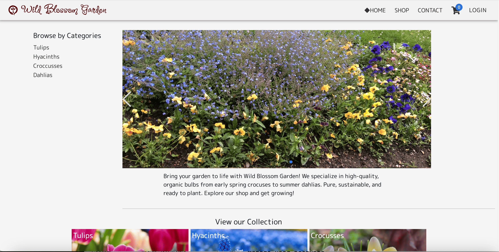

Deployed project:
[Wild Blossom Garden](https://main.d318qultnvdzu6.amplifyapp.com)

### Overview

Wild Blossom Garden is an imaginary shop selling flower bulbs online. Here users can browse products, place items in their carts, enter delivery and payment information and place orders. They can also view their order history and submit feedback about their purchase. This frontend application communicates with a Rest API built with Java Spring Boot, which manages authentication of requests and processes interactions with the database.
The application is built responsible for various screen sizes above 330px.

The source code for the Rest API can be found <a href="https://github.com/rkyzk/ecommerceapi/tree/dev-eng" target="_blank">here</a>.

### Languages, Framework

JavaScript, Vite 6.3.1, React 19.1.1

### Libraries Used

- 'redux' for making data available in any component
- 'axios' for handling requests and responses to and from the Rest API
- 'stripe' for handling credit card information
- 'jposta' for autofilling addresses by postal codes
- 'react hot toast' for toast messages
- 'material UI' for ready made components to be used with or without modification
- 'react icons'
- 'swiper' for carousels
- 'tailwindcss' for styling

### Main Functions

- Browse Products
- View product details
- Search products by keywords, categories and colors
- Sort products by popularity or prices
- Manage user accounts
- Login/logout users (JWT and refresh tokens are used.)
- Add items to carts, update quantities and delete products.
- View items in the cart and the total price
- Enter delivery and payment information
- Place orders
- View order history, submit feedback of purchases
- View review entries of other customers

### Common Elements and Each Page in Detail

<h3 style="fontSize: 1rem;">1. Common Elements on Multiple Pages</h3>

#### Navigation Bar

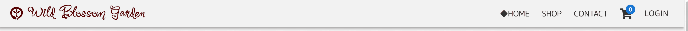

- Placed at the top of the page, the navigation bar offers the following links.
  |Nr. |Item |Destination of the link (or events when clicked.) |
  |:--:|:-------------|:---------------------|
  |1. |Logo |Landing Page |
  |2. |Home |Landing Page |
  |3. |Shop | Product list page |
  |4. |Contact| Contact form |
  |5. |Cart | The current user's cart page|
  |6. |Login  (When the user is  not logged in) |Login or register dialog will be displayed|
  |7. |The current user's username| A dropdown menu appears.|

- When the current user's name in the navigation bar is clicked, the following options will be displayed in the dropdown menu.
  |Nr. |Item |Destination of the link, (or action when clicked.) |
  |:--:|:-------------|:---------------------|
  |1. |Order History & Send Feedback |Order history page |
  |2. |Logout |The user will be logged out and will be taken to the landing page. |

#### Menu Column

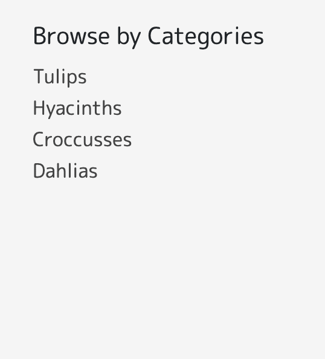 
On the landing page, cart page and checkout page, a menu column appears on the left side of the window if the screen size exceeds 767px. The menu column allows for quick access to product list of each category.

#### Footer

 
The footer includes the brand of the shop, a copyright statement and links to facebook and instegram.

#### Login/Register Dialog

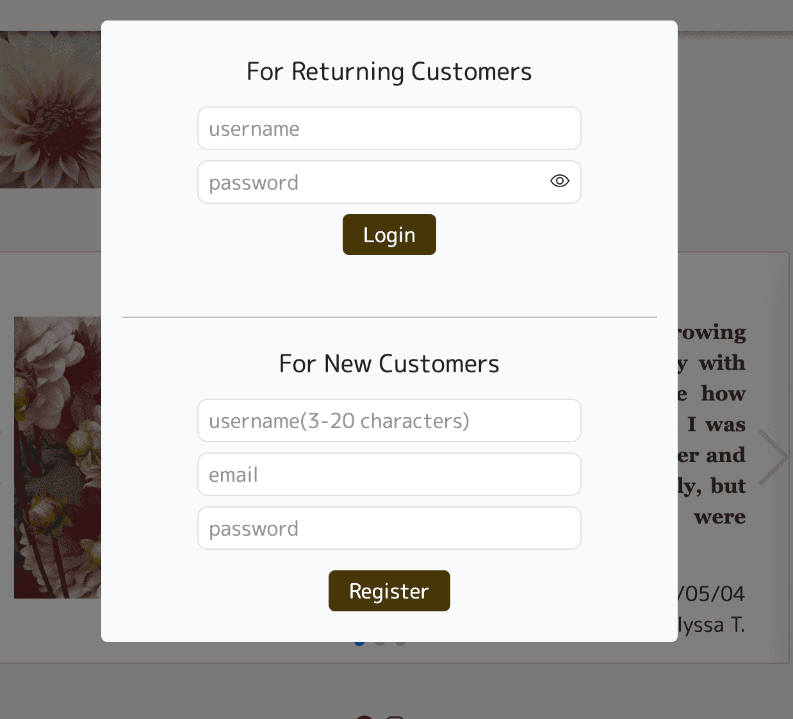 

- When 'LOGIN' button in the navigation bar is clicked, a login and register dialog will appear. 
- Visitors who don't have an account should enter a username, a valid email and a password in the register form. 
- Input in the register form will be validated in following methods in Register.jsx, and an error message(s) will be displayed in red if the input is invalid. 

| Item     | Restriction                                                   | Function name    |
| :------- | :------------------------------------------------------------ | :--------------- |
| username | 3-20 letters                                                  | validateUsername |
| email.   | must contain @ and afterwards a dot in the middle of a String | validateEmail    |
| password | 8-16 letters containing alphabets and numerals                | validatePassword |

- If the username or email are already used, the Rest API will return an error response, and the error message will be displayed.
- Returning users will enter their username and password in Login dialog. 
- Error messages will be displayed if the Rest API finds the username and the password don't match, or if the connection to the Rest API is disrupted. Otherwise the user can log in. 

<h3 style="fontSize: 1rem;">2. Each Page in Detail</h3>

#### Landing Page

The landing page showcases products and promotes sales while offering enjoyable visual experience for site visitors. It contains an eyecatching hero banner, quick access to product lists and positive review entries from customers.

- Hero Banner 
  A carousel displays scenaries of the garden displaying various flowers in full bloom. Autoplay and fade effects of 'swiper' library are applied in order to offer enjoyable visual experience.

- 'View our Collection' 
  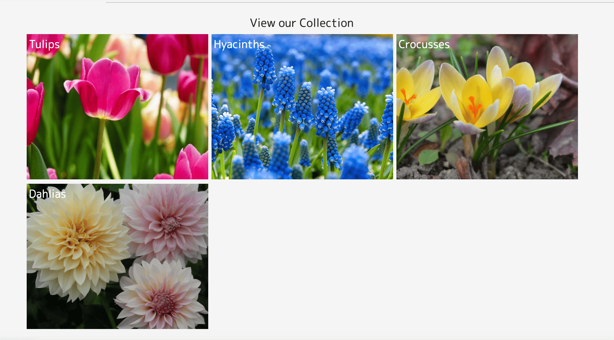 
  In this section the image of each category is a link to a product list of that category. This section aims to invite users to browse products.

- 'Compliments from Our Customers' 
  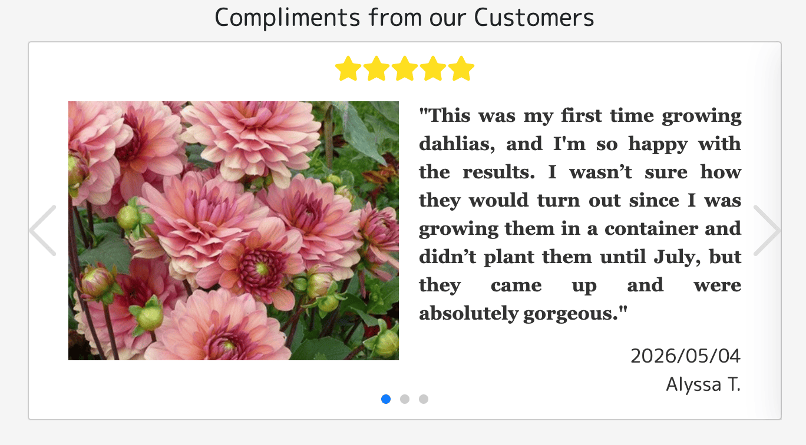 
  The section introduces positive feedback entries from customers, which will promote sales. In this application, customers can submit feedback and optionally an image of their purchased product on 'Order History' page. When admin personnel reviews the entry and decides to post it, they can set publicizeFlg of the record in the DB table 'Reviews' to true, and the entry will be shown in the section. The reviews are shown in the order of the most recent to the oldest. The review contains the customers's feedback, reviewed date, the customer's display name and an image.

#### Product List Page

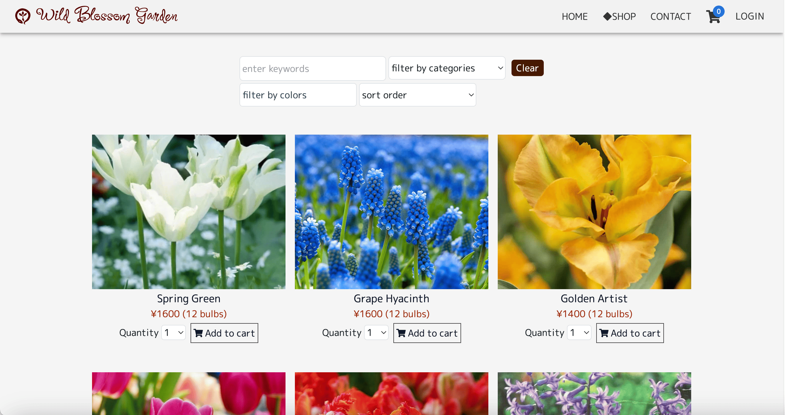

#### 1. Filter and sort

- The product list page offers filter and sort options and displays a product list accordingly.
- If multiple filter options are displayed, the products that match all options will ne displayed.

#### Keywords Filter

- Users can enter keywords in the input box.
- Only those products will be selected, whose data (product name and product detail) contain one of more of the keywords.

#### Color Filter

- One or more colors can be selected in the checkbox, and the products that match at least one color will be displayed as results.
- Products may be classified as having only one color or multiple colors.

#### Category Filter

- Flower kind can be selected by the pulldown box.

#### Order by popularity

- When 'most sold' is selected, the products will be ordered by the sales count in the past 30 days.

#### Order by prices (low to high)

- As the label suggests, the products will be ordered by ascending prices.

#### 2. Other Features

- Clicking the product images take the users to product detail pages.
- Users can add products to their cart by clicking 'Add to cart' buttons.
- Quantity can be adjusted with the pulldown box.

#### Product Detail Page

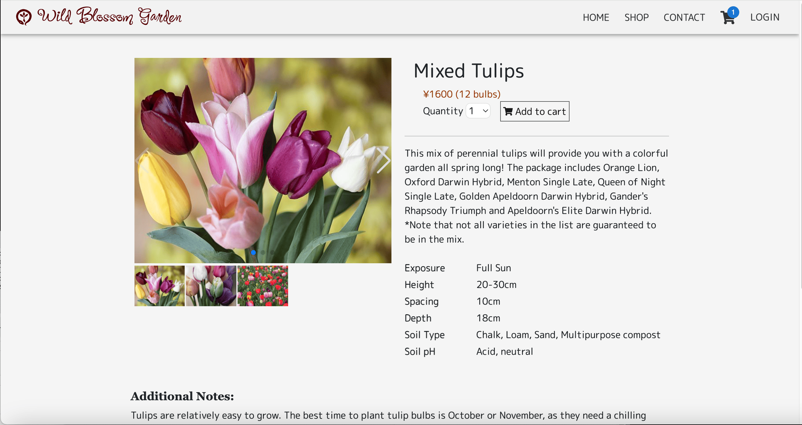 

1. If multiple images are stored for the product, users can click pagination buttons to view other images. All images are posted in small size below the main image.
2. Users can set quantity and click 'Add to cart' to place the item in the cart.
3. A short paragraph introduces the features of the product.
4. A list provides data such as plant height, desired spacing and depth at planting as well as soil conditions.
5. 'Additional Notes' section provides users with growing tipps. These notes are written for each category -- the same notes are posted for all tulips, and that applies for other categories.

#### Contact Page

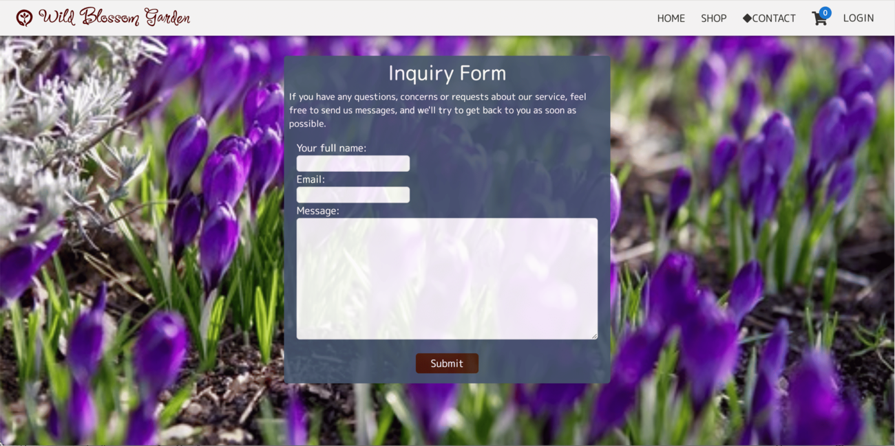 
If users wish to contact the personnel of Wild Blossom Garden, they can fill in the inquiry form. The page is not equiped with the function to actually save the form to be reviewed.

#### Cart Page

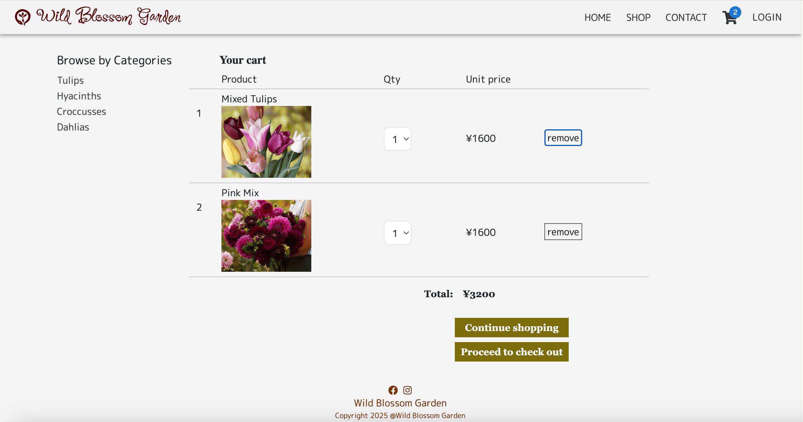 

1. The cart page shows a table of products, quantities, unit prices and the total price of the cart.
2. Users can change the quantity using the pulldown box, and the total price will be updated accordingly.
3. If 'Continue Shopping' is clicked, users are taken to the product list page.
4. If 'Proceed to Checkout' is cliecked, users are taken to the checkout page.
5. The cart data will not be sent to the backend until users place orders.
6. If the user logs out, the cart data will be lost.

#### Checkout Page

1. Address section

- If the current user has not saved addresses previously, a shipping address form will be displayed. If the user has saved an address(es), the saved address(es) will be displayed. The same applies for billing addresses.
- By default the billing address is set to be the same as shipping address. Users can check the radio botton if they need to enter a different address.
- Users can choose to save or not save the address. If they choose to save the address, it will be stored in the database when they place orders and will be displayed next time they make orders.
- Users can set the address as default address so that the address will appear at the top, and the radio button will be checked.

2. Card Information

- Users can enter their credit card information. The card information won't be saved in the database. The Stripe API will verify the card information and will display error messages if the input is invalid.

3. Items in the Cart

- Cart items and the total price are shown in 'Items in the Cart' section, so users can make sure the order is what they intend before they proceed to make payment.
- If 'Proceed to Purchase' button is clicked, the order will be placed (the order data will be sent to the Rest API), and users will be taken to the order confirmation page.

#### Order Confirmation Page

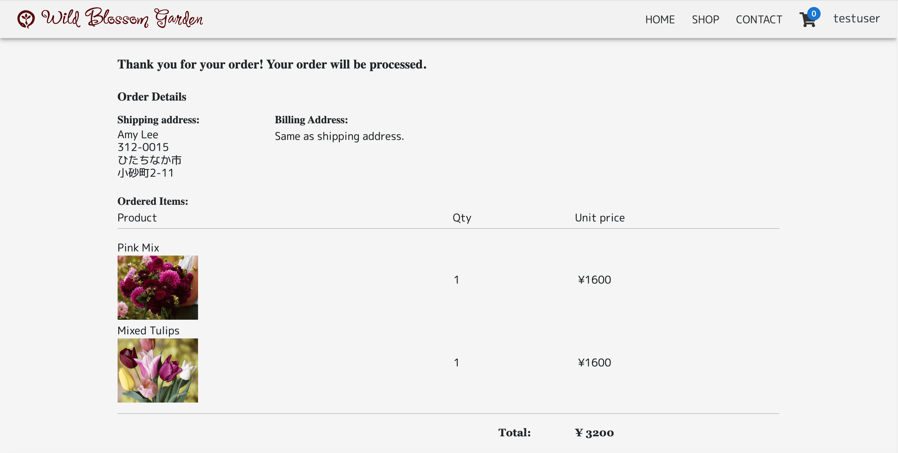 

1. A note, 'Thank you for your order! Your order will be processed,' will be displayed at the top.
2. Shipping address (and billing address if it differs from the shipping address) is displayed.
3. A table of ordered items, quantities and unit prices as well as the total price of the order will be displayed.

#### Order History Page

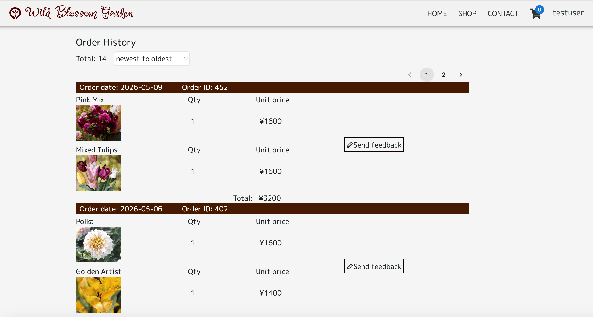 

1. The current user's past purchases are listed. The data includes the date of purchase, product names, images, quantities, unit prices and the total price.
2. By default the list is ordered by the date of purchase, showing the most recent record at the top, but the sort order can be reversed by selecting 'oldest to newest' in the pulldown.
3. If there are more than eight results, 8 results will be shown per page, and pagination buttons at the top of the table allow users to navigate the pages.
4. By clicking 'submit feedback' button, users can send feedback about their particular order. The entries will be saved in the database, and if the publicizeFlg of the record is later set to 'true,' the entry will be posted on the landing page. (The admin personnel can choose which reviews to post.)
5. The feedback can't be updated once submitted. The purchase will be labeld with a note saying 'Feedback Submitted.'

### Credits

I learned methods to build ecommerce applications in the following course at Udemy: 
  "Java Spring Boot professional eCommerce project master class" 
  https://github.com/EmbarkXOfficial/spring-boot-course 
  Many aspects used in this application are taken from the course.

Paragraphs used in the app are taken and modified from the following sources.

- Introduction on the landing page. 
  https://shop.hanano-yamato.co.jp

- Review Entries 
  https://russellsmillsflowerco.com/pages/reviews?srsltid=AfmBOoqZm2Eo8DMq6DLf0MM5P129YBGATlrbwkyxQB4l_ZaIp8yC_msr

- Product Detail Pages 
  https://www.pref.toyama.jp/1613/sangyou/nourinsuisan/nougyou/kj00014132/kj00014132-011-01.html 
  https://www.919g.co.jp/blog/?p=7420 
  https://www.gardenersworld.com/how-to/grow-plants/best-crocus-varieties-to-grow/ 
  https://northernwildflowers.ca/collections/shop-seeds/products/smooth-aster 
  https://www.gardenia.net/plant/tulipa-apricot-beauty-single-early-tulip 
  https://www.peternyssen.com/autumn-planting/miscellaneous-bulbs/camassia/blue-heaven.html 
  https://www.gardenersworld.com/how-to/grow-plants/best-crocus-varieties-to-grow/ 
  https://www.gardenia.net/plant/tulipa-apricot-beauty-single-early-tulip 
  https://www.peternyssen.com/autumn-planting/miscellaneous-bulbs/camassia/blue-heaven.html 
  https://www.edenbrothers.com/products/dahlia-bulbs-belle-of-barmera 
  https://www.peternyssen.com/autumn-planting/tulips.html?p=2 
  https://en.wikipedia.org/wiki/Crocus#/media/File:860808-Saffronfarm-01-IMG_7707-2.jpg 
  https://www.bulbi.nl/en/barcelona 
  https://www.longfield-gardens.com/blogs/all-about-fall-planted-bulbs/all-about-crocus?srsltid=AfmBOoqgGQz2gYQu2CWDxciVl-4dh-UHjXU78a_b-AKofO9gvS6t5_LN

I utilized code snippets from the following websites.

- Drop down box for product quantity 
  https://stackoverflow.com/questions/74367838/react-select-dropdown-from-1-to-n

- Spinner 
  https://tw-elements.com/docs/standard/components/spinners/

- Logic to send image file from react to the backend 
  https://zenn.dev/juth/articles/form-json-formdata-spring

### Bugs

Autofocus on Login dialog is not working.
Footer is not shown on Contact Page.
